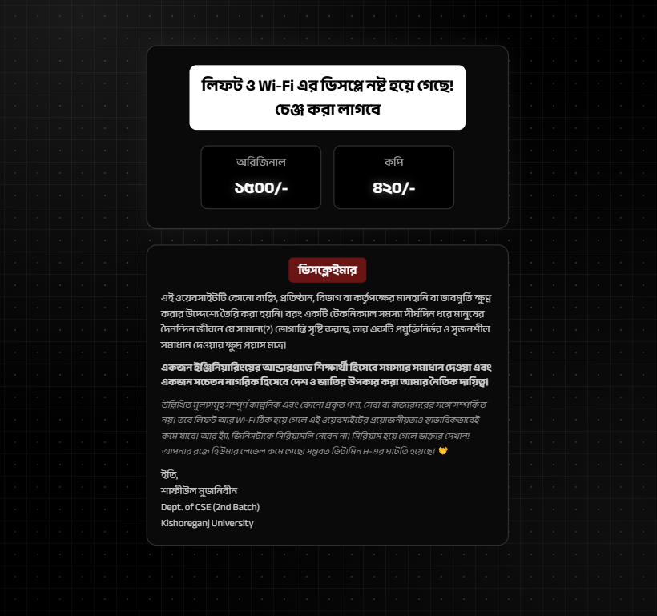

# LWiFi Solution by Shafi

> A humorous and satirical web project inspired by recurring lift and Wi-Fi issues at a university.

## Overview

**LWiFi Solution by Shafi** is a small, humorous, and satirical web project inspired by recurring student experiences involving university lift and Wi-Fi issues.

The website is based on a familiar and popular meme concept, presented in the form of a fictional technical service offering a humorous “solution” for replacing malfunctioning displays . Although the presentation is intentionally playful, the underlying idea reflects a genuine student concern.

Rather than treating the issue as something to simply accept or remain silent about, the project uses metaphor, humor, and web technology as an alternative form of expression. Since students may not always have a direct or convenient way to protest or communicate such concerns, a creative approach can help bring attention to them without turning the project into a direct confrontation.

The website is therefore both a **funny meme-based project and a small form of metaphorical student expression**: a reminder that when something affects us, we can at least find a constructive and creative way to speak about it.

### Live Website

The project is available online at:

**https://sumujnibeen.github.io/Lwifi/**

## Purpose

The primary purpose of this project is to present a common student concern through humor, satire, and metaphor rather than through direct confrontation.

As students, there are not always straightforward or accessible ways to directly raise or address certain everyday problems. Instead of remaining silent, this project uses a familiar and popular meme-based concept to creatively draw attention to the issue.

The fictional “LWiFi Solution” is therefore not intended to represent an actual service or commercial proposal. It is a metaphorical way of saying that when students face a problem, doing something constructive to highlight it is better than simply remaining silent.

The project aims to encourage a simple idea:

> **If a problem affects us, we should find a way to raise awareness about it rather than simply accepting it as normal.**

At its core, this is a small creative experiment that combines humor, web development, and student expression to communicate a real-world concern in a light-hearted manner.

## Technologies Used

* HTML5
* CSS3
* Anek Bangla
* Responsive Web Design
* CSS Gradients and Visual Effects

No JavaScript framework, backend, or external application framework is required.

## Screenshot

The following screenshot shows the current interface of the LWiFi Solution website.

## Disclaimer

This website was not created with the intention of defaming, insulting, or damaging the reputation of any individual, institution, department, or authority.

It is simply a humorous and creative representation of a technical problem that has become familiar in everyday university life.

The project should not be taken as an actual service proposal or quotation.

## Author

**Shafiul Mujnibeen**

Department of CSE, 2nd Batch
Kishoreganj University

## License

This project is intended for personal, educational, and entertainment purposes.
